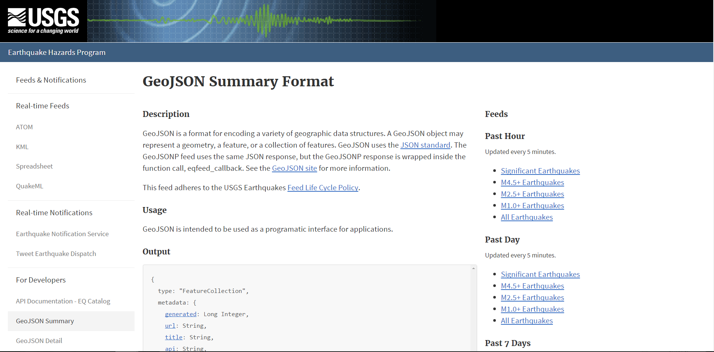

# leaflet-challenge: Visualizing Data with Leaflet

## Background

I am building a new set of tools that will allow them to visualize their earthquake data obtained from United States Geological Survey, or USGS. This will help to better educate the public and other government organizations (and hopefully secure more funding) on issues facing our planet.

### Level 1: Basic Visualization

To visualize an earthquake data set.

1. **Data set**

   

   [USGS GeoJSON Feed](http://earthquake.usgs.gov/earthquakes/feed/v1.0/geojson.php) 

   

2. **Import & Visualize the Data**

   Created a map using Leaflet that plots all of the earthquakes from your data set based on their longitude and latitude.

   * Data markers reflect the magnitude of the earthquake by their size and and depth of the earthquake by color. Earthquakes with higher magnitudes should appear larger and earthquakes with greater depth should appear darker in color.

   * Included popups that provide additional information about the earthquake when a marker is clicked.

   * Created a legend that will provide context for your map data.

	
